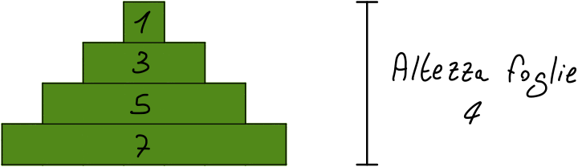

# Ambiente Voxel generato da immagine RGB

L'idea di base del progetto è quella di generare automaticamente un ambiente 3D costutito solamente da cubi dove sono presenti
- un terreno verde
- degli alberi, con forma di pini, composti da un tronco molto basso e l'approssimazione di una piramide che rappresenta le foglie. Gli alberi sono animati con un leggero movimento delle foglie.
- un flusso d'acqua

oltre ad una luce animata che rappresenta il ciclo giorno-notte. L'input di questo sistema è un'immagine RGB contenente solamente i seguenti colori
- verde con diversi livelli di luminosità, comunque nel range [0, 255], per l'erba, dove la luminosità è inversamente proporzionale all'altezza
- rosso con diversi livelli di luminosità, comunque nel range [0, 255], per gli alberi, dove la luminosità è direttamente proporzionale all'altezza dell'albero
- azzurro (verde + blu) con luminosità 255 per l'acqua

## Sviluppo
### Alberi

Gli alberi vengono generati automaticamente specificando altezza e larghezza.

#### Tronco
Il tronco è composto da dei cubi marroni, colore `0xC26D3F`, ottenuto prendendo spunto dai colori che Minecraft usa per il legno.

#### Foglie

L'idea originale per la creazione delle foglie era avere una struttura che approssimasse un cono con una serie di quadrati di cubi di dimensione proporzionalmente crescente l'uno rispetto all'altro. Il risultato che si sarebbe ottenuto però non avrebbe per nulla rispecchiato un albero, quindi si è deciso di rimappare i valori originali della larghezza di ciascun livello in un intervallo dettato da una larghezza massima (quella della base) scelta come parametro di generazione dell'albero. Di default la larghezza massima corrisponde a metà dell'altezza dell'albero, dal momento che sembra essere la più aderente alla realtà.

### Erba

La generazione dell'erba è molto semplice: di base è presente un cubo di erba verde, colore `0x90BF60`, per ogni pixel dell'immagine, indipendentemente dal colore, dal momento che l'erba è la base dell'intera scena. A questo caso si esclude ovviamente l'acqua. L'altezza dell'erba è inversamente proporzionale alla luminosità del verde, ma comunque con un valore massimo determinato da una variabile che scala quello massimo del colore RGB a 8 bit. Questa variabile è impostata di default a 0.1.