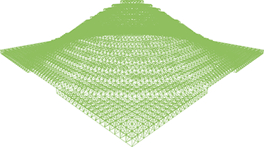

# Ambiente Voxel generato da immagine RGB

L'idea di base del progetto è quella di generare automaticamente un ambiente 3D costutito solamente da cubi dove sono presenti

- un terreno verde
- degli alberi, con forma di pini, composti da un tronco molto basso e l'approssimazione di una piramide che rappresenta le foglie. Gli alberi sono animati con un leggero movimento delle foglie.
- un flusso d'acqua

oltre ad una luce animata che rappresenta il ciclo giorno-notte. L'input di questo sistema è un'immagine RGB contenente solamente i seguenti colori
- verde con diversi livelli di luminosità, comunque nel range [0, 255], per l'erba, dove la luminosità è inversamente proporzionale all'altezza
- rosso con diversi livelli di luminosità, comunque nel range [0, 255], per gli alberi, dove la luminosità è direttamente proporzionale all'altezza dell'albero
- azzurro (verde + blu) con luminosità 255 per l'acqua

## Sviluppo
Lo sviluppo si è diviso in molte parti diverse per la realizzazione dei diversi elementi della scena.

La linea di fondo di tutto il codice è che i cubi possono essere posizionati solamente in coordinate intere per scelta di progettazione, chiaramente tenendo conto che la coordinata specificata per la posizione è quella del centro del cubo e che quindi per posizionare un cubo di dimensione 1 in modo che le sue facce siano giancenti su piani con coordinate intere è necessario aggiungere 0.5 ad ogni coordinata intera.

### Alberi

Gli alberi vengono generati automaticamente specificando altezza e larghezza.
Nel codice è impostata la proporzione tra altezza del tronco e altezza del fogliame: considerando alcuni esempi di pini reali la proporzione della base rispetto all'altezza complessiva dell'albero sembra essere 0.15 su 1, quindi il rimanente 0.85 corrisponde alle foglie.
La larghezza dell'albero, corrispondente alla larghezza del primo strato di foglie (quello più grande), deve essere dispari, dal momento che il quadrato di cubi di foglie ha sempre lato dispari (considerando che si parte dal centro, ovvero dal tronco, devono sempre esserci *n* cubi alla sua sinistra, destra, sopra e sotto). Per questo si controlla se la larghezza è pari: se lo è viene addizionata di 1.

#### Tronco
Il tronco è composto da dei cubi marroni, colore `0xC26D3F`, ottenuto prendendo spunto dai colori che Minecraft usa per il legno.
Per evitare che il tronco sia di altezza 0 in caso di albero troppo basso viene controllata questa condizione, e viene posto di altezza 1 se verificata. A questo punto i cubi che compongono il tronco vengono semplicemente impilati uno sull'altro, in numero corrispondente a quanto dettato dall'altezza dell'albero e dalla proporzione del tronco rispetto all'altezza.

#### Foglie

L'idea originale per la creazione delle foglie era avere una struttura che approssimasse un cono con una serie di quadrati di cubi di dimensione proporzionalmente crescente l'uno rispetto all'altro. Il risultato che si sarebbe ottenuto però non avrebbe per nulla rispecchiato un albero, quindi si è deciso di rimappare i valori originali della larghezza di ciascun livello in un intervallo dettato da una larghezza massima (quella della base) scelta come parametro di generazione dell'albero. Di default la larghezza massima corrisponde a metà dell'altezza dell'albero, dal momento che sembra essere la più aderente alla realtà.

Un altro aspetto di implementazione delle foglie è il fatto che non è necessario generare tutti i cubi, ma solo quelli realmente visibili (escludendo quindi quelli interni). Per questo la generazione delle foglie viene divisa in due parti
- una prima nella quale ci si trova al livello più basso, quindi il più largo, dove è necessario generare un quadrato di cubi di dimensione `treeWidth`
- una seconda nella quale ci si trova negli altri livelli, dove è necessario generare solamente i cubi più esterni

  

  Anche in questo caso la computazione si divide in due casi
  - il primo nel quale, iterando prima su z per rispettare la logica row-major, z stessa è al suo massimo o minimo (nell'esempio -2 e 2). In questo caso è necessario creare tutti i cubi di quella riga, uno per ogni x.
  - il secondo nel quale invece ci si trova nei valori intermedi di z: in questo caso è sufficiente creare i cubi con x massima e minima (nell'esempio -2 e 2)

### Erba

La generazione dell'erba è molto semplice: di base è presente un cubo di erba verde, colore `0x90BF60`, per ogni pixel dell'immagine, indipendentemente dal colore, dal momento che l'erba è la base dell'intera scena. A questo caso si esclude ovviamente l'acqua. L'altezza dell'erba è inversamente proporzionale alla luminosità del verde, ma comunque con un valore massimo determinato da una variabile che scala quello massimo del colore RGB a 8 bit. Questa variabile è impostata di default a 0.1.
Per i pixel dell'immagine che non sono verdi, perché indicanti la presenza di altri elementi, viene calcolata un'altezza determinata dalla mediana comprendente
- gli 8 cubi che circondano quello analizzato
- un'altra mediana tra i cubi immediatamente a destra e a sinistra di quello considerato, in modo che la riga sopra e sotto non abbiano maggiore peso

